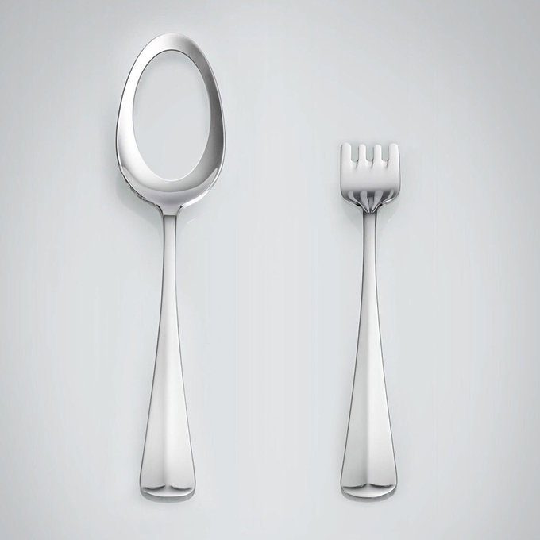

+++
title = "22 / Intentional connection in the digital office"
date = "2021-09-12"
[extra]
num = 22
+++

Hello and welcome to another issue of Arnes Weekly! Hope your week was good, enjoy ✌🏻

## Tweet of the Week
> “I’m sorry, but we had to cut down the scope to make the deadline.”
> 
> — [@WdeB on Twitter](https://twitter.com/WdeB/status/1436051539450376200)

## Culture
* [Intentional connection in the digital office](https://seths.blog/2021/09/intentional-connection-in-the-digital-office/) (seths.blog) — Seth Godin about the difference of online and offline human connection.
* [Why did the web take over desktop and not mobile?](https://subconscious.substack.com/p/why-did-the-web-take-over-desktop) (subconscious.substack.com) — Gordon Brander explains the reasons why so many desktop apps are web based (e.g. Electron), but most mobile apps are still native.
* [The Mentorship Diamond](https://mikemcquaid.com/2021/09/09/the-mentorship-diamond/) (mikemcquaid.com) — Mike McQuaid about mentorship and why it is important (in both directions).

## Software Engineering
* [Coverage Marks](https://ferrous-systems.com/blog/coverage-marks/) (ferrous-systems.com) — Aleksey describes the concept of coverage marks. Pretty cool concept.
* [Why it's reliable enough for production](https://pythonspeed.com/fil/docs/fil4prod/reliable.html#guiding-principles) (pythonspeed.com) — The docs of the Python memory profiler called `filprofiler` have some insights on what's required for production-level Rust.
* [Rust programs written entirely in Rust](https://blog.sunfishcode.online/rust-programs-entirely-in-rust/) (blog.sunfishcode.online) — sunfishcode about what it takes to have Rust programs only depend on Rust code (not libc and friends). 
* [A Better Shell](https://matklad.github.io//2019/11/16/a-better-shell.html) (matklad.github.io) — Aleksey Kladov has a wishlist of improvements for his shell.
* [How PCI-Express works and why you should care? #GPU](https://www.ovh.com/blog/how-pci-express-works-and-why-you-should-care-gpu/) (ovh.com) — A great explanation of PCIe and what to look out for when trying to maximise your GPU performance.
* [Quadratic algorithms are slow (and hashmaps are fast)](https://jvns.ca/blog/2021/09/10/hashmaps-make-things-fast/) (jvns.ca) — Julia Evans compares linear and quadratic algorithms with concrete examples.

## Cutting Room Floor
* [mRNA cancer therapy now in human trials after shrinking mouse tumours](https://www.independent.co.uk/news/science/mrna-cancer-therapy-human-trials-tumours-b1917739.html) (independent.co.uk) — Thomas Kingsley about BioNTech moving to human trials for their mRNA-based cancer therapy!
* [Art Student’s 407-Piece Hand-Carved Wooden Clock Literally Writes The Time](https://www.ablogtowatch.com/suzuki-kango-plock-wooden-automaton-time-writing-clock) (ablogtowatch.com) —Zen Love about the crazy wooden clock by Suzuki Kango’s. Watch the video!
* [The 'Dead-Internet Theory' Is Wrong but Feels True](https://www.theatlantic.com/technology/archive/2021/08/dead-internet-theory-wrong-but-feels-true/619937/) (theatlantic.com) — Kaitlyn Tiffany about the conspiracy story that most of the internet today is bots.
* [Ok. So, You Can’t Decide.](https://randsinrepose.com/archives/ok-so-you-cant-decide/) (randsinrepose.com) — Michael Lopp about what to do when you just can't decide.
* [The disastrous voyage of Satoshi, the world’s first cryptocurrency cruise ship](https://www.theguardian.com/news/2021/sep/07/disastrous-voyage-satoshi-cryptocurrency-cruise-ship-seassteading) (theguardian.com) — Sophie Elmhirst tells the story of the failed plan to sell flats on a cruise ship for a tax-free cryptocurrency dream-society.