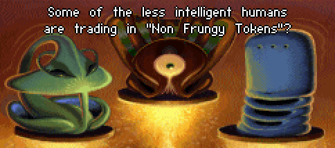

+++
title = "43 / Why You Should Start a Blog Right Now"
date = "2022-02-13"
[extra]
num = 43
+++

Hey hey, how was your week? ✌🏻

## Tweet of The Week

> Extremely niche #msdos
> 
> — [@voxel on Twitter](https://twitter.com/voxel/status/1492049780734050304)

## Favourites
### [Some mistakes Rust doesn't catch](https://fasterthanli.me/articles/some-mistakes-rust-doesnt-catch)
_39 min · fasterthanli.me_

Amos writes another great post about the safeties built into Rust in comparison with other languages and then goes into the things Rust won't catch for you as of right now.

### [What's coming in Go 1.18](https://lwn.net/SubscriberLink/883602/49e588e5d73cef84/)
_8 min · lwn.net_

In case you ignored all previous posts (to be fair, they were mostly about generics), here's a summary of everything that will come to Go 1.18, by Vegard Stikbakke.

## Culture
### [Why You Should Start a Blog Right Now](https://guzey.com/personal/why-have-a-blog/)
_19 min · guzey.com_

Alexey Guzey has a list of reasons why you should start a blog right now. _Thanks, Jan!_ 

### [My Seatbelt Rule for Judgment](https://www.dannyguo.com/blog/my-seatbelt-rule-for-judgment/)
_1 min · dannyguo.com_

Danny Guo has a personal rule when it comes to judgement:

> My willingness to judge something should be proportional to how much I know about it.

### [In Defence of the Boring Web](https://bastian.rieck.me/blog/posts/2022/boring/)
_3 min · bastian.rieck.me_

Bastian Rieck defends the boring web (without JavaScript, cookie banners or subscribe now popups) and I'm there for it.

## Software Engineering
### [Downcasting in Rust](https://ysantos.com/blog/downcast-rust)
_10 min · ysantos.com_

Y. D. Santos about the technical background of downcasting in Rust.

### [Async Rust in 2022](https://blog.rust-lang.org/inside-rust/2022/02/03/async-in-2022.html)
_5 min · blog.rust-lang.org_

Niko Matsakis and Tyler Mandry talk about their vision of async Rust (on behalf of the Async Working Group) and what will happen this year.

### [Top 10 web hacking techniques of 2021](https://portswigger.net/research/top-10-web-hacking-techniques-of-2021)
_6 min · portswigger.net_

James Kettle has a list of current web hacking techniques that you should defend against.

### [In defense of complicated programming languages](https://viralinstruction.com/posts/defense)
_13 min · viralinstruction.com_

Jakob compares complicated and seemingly simple programming languages and tells us why he prefers the openly complicated.

## Cutting Room Floor
### [Unlearning Perfectionism](https://arunkprasad.com/log/unlearning-perfectionism/)
_10 min · arunkprasad.com_

Arun Prasad about perfectionism and better alternatives.

### [Why Is Matt Damon Shilling for Crypto?](https://www.nytimes.com/2022/02/02/magazine/matt-damon-crypto.html)
_6 min · nytimes.com_

Jody Rosen about Matt Damon, Snoop Dogg and other celebrities:
> The ad holds out the promise of “fortune,” but what it’s really selling is danger, the dark and desperate thrills of precarity itself — because, after all, what else have we got? You could call it truth in advertising.