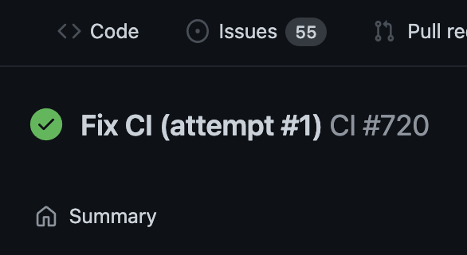

Hey, how's it going? ✌🏻

## Tweet of The Week

> truly blessed day
> 
> — [@tmandry on Twitter](https://twitter.com/tmandry/status/1486534292360470528)

## Favourites

### [Contemplating calendars](https://devonzuegel.com/post/contemplating-calendars)

_5 min · devonzuegel.com_

Devon Zuegel has an interesting way to use their calendar and seems to get way more out of it than the average person.

## Culture

### [The complexity of knowledge and skill transfer](https://danluu.com/hardware-unforgiving/)

_7 min · danluu.com_

Dan Luu about the importance of experience in the software engineering field.

### [@lilykonings on Twitter](https://twitter.com/lilykonings/status/1484598087494496258)

_1 min · twitter.com/lilykonings_

Lily Konings has five questions to ask your future manager back in your interview.

### [Technical Feasibility](https://www.biodigitaljazz.tech/p/technical-feasibility)

_9 min · biodigitaljazz.tech_

Tim Reynolds describes the job of a tech lead, arguing that feasibility should be the central theme.

### [The Biggest Mistake I See Engineers Make](https://web.archive.org/web/20230404051537/https://thezbook.com/the-biggest-mistake-i-see-engineers-make)

_4 min · thezbook.com_

Zach Lloyd about the problem with engineers working on a big or important project without involving their team.

## Software Engineering

### [Go is about to get a whole lot faster](https://dominictobias.medium.com/go-is-about-to-get-a-whole-lot-faster-a50c1e7d60b9)

_2 min · dominictobias.medium.com_

Dominic Tobias ported a library to new generics and the benchmarks show a 2-3x increase.

### [Tutorial: Getting started with generics](https://go.dev/doc/tutorial/generics)

_10 min · go.dev_

The official Go tutorial to get started with generics, one of the most exciting (and controversal) features ever for the language.

### [I’m porting tsc to Go](https://kdy1.dev/posts/2022/1/tsc-go)

_2 min · kdy1.dev_

DongYoon Kang explains why he chose to rewrite the TypeScript Type Checker in Go instead of Rust.

### [Hosting my static sites with nginx](https://jvns.ca/blog/2022/01/24/hosting-my-static-sites-with-nginx/)

_6 min · jvns.ca_

Julia Evans explains her infrastructure and deployment setup for the websites they host.

### [The Curse of NixOS](https://blog.wesleyac.com/posts/the-curse-of-nixos)

_7 min · blog.wesleyac.com_

Wesley Aptekar-Cassels about NixOS and it's flaws, but also why he can't go back.

### [Prefer to change the code rather than write a workaround](https://catern.com/change_code.html)

_3 min · catern.com_

Spencer Baugh makes the point that unless you have a valid excuse (which you most likely don't have), you should fix code instead of working around it.

## Cutting Room Floor

### [A Science Experiment: published!](https://berthub.eu/articles/posts/a-science-experiment-got-published/)

_11 min · berthub.eu_

Bert Hubert has a list of tips to get your paper published in a journal as an outsider.

### [Yet Another Hot Take on “Folders versus Tags”](https://eleanorkonik.com/yet-another-hot-take-on-folders-versus-tags/)

_18 min · eleanorkonik.com_

Eleanor Konik prefers folders to tags in his slip-box.

### [Buy Things, Not Experiences](https://write.as/harold-lee/theres-a-phrase-going-around-that-you-should-buy-experiences-not-things)

_3 min · write.as_

Harold Lee in an argument against the trend to "buy experiences, not things".

### [nft-to-silly-jpeg](https://github.com/k-wong/nft-to-silly-jpeg)

_github.com/k-wong_

Kevin Wong created a browser extension that replaces the term "nft" with "silly jpeg" and I'm here for it.
